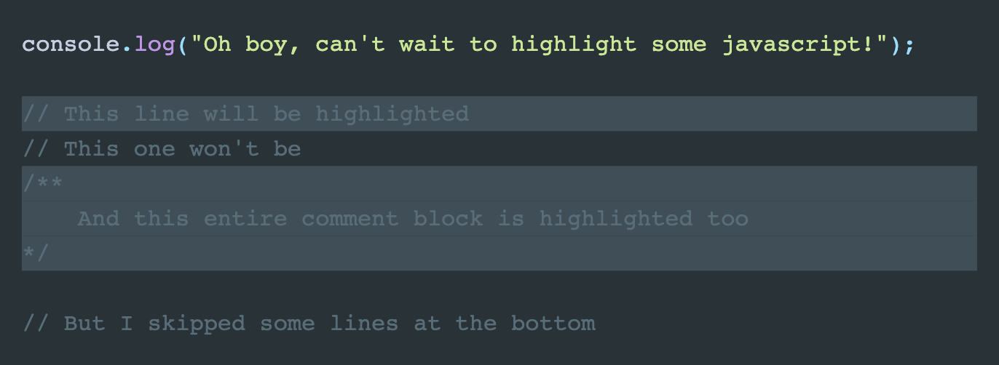
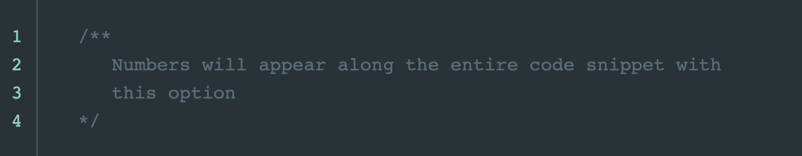
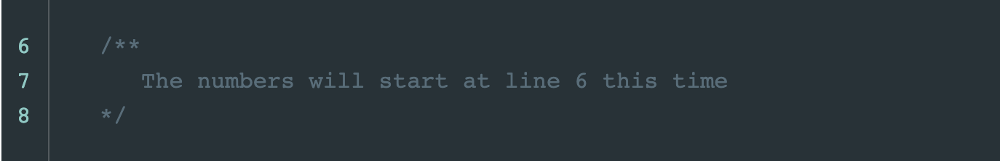

# Writing MDX

This is a quick reference.

## Code Snippets

For more details, please view the official
[gatsby-remark-prismjs](https://github.com/gatsbyjs/gatsby/tree/master/packages/gatsby-remark-prismjs)
documentation.

### Highlighting Lines

```markdown
    ```javascript{2,4-6}
    console.log("Oh boy, can't wait to highlight some javascript!");
    // This line will be highlighted
    // This one won't be
    /**
        And this entire comment block is highlighted too
    */
    ```
```


### Line Numbers

If you want to have line numbers appear, starting at 1, use `{numberLines: true}`
```markdown
   ```javascript{numberLines: true}
   /**
       Numbers will appear along the entire code snippet with 
       this option
   */
    ```
```


Otherwise, you can specify the number you'd like to start from
```markdown
   ```javascript{numberLines: 6}
   /**
       The numbers will start at line 6 this time
   */
    ```
```
